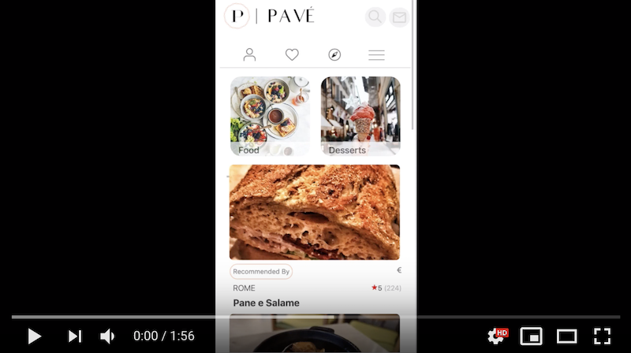

# Pavé 

## Table of Contents

1. [General Info](#general-info)
1. [Demo](#demo)
1. [Setup](#setup)
1. [Requirements](#requirements)

## General Info

>Pavé is a mobile-first web application that combines aspects of food, travel, and social media. Users are able to add top-rated restaurants around the world to their recommendations and connect with friends to view their favorites as well. With a time constraint of one week, we challenged ourselves by setting base and stretch goals, implementing central features with the MVP model in mind. 

## Demo

## Setup
Create yelpconfig.js and gmapconfig.js files in the root directory to hold yelp and google maps geocoding API keys

yelpconfig.js file format:

    let REACT_APP_YELP_API_KEY = function () {
        return 'Bearer (YOUR API KEY HERE)'
    }
    module.exports = REACT_APP_YELP_API_KEY;

gmapconfig.js file format:
    
    let gmapKey = '(YOUR API KEY HERE)';
    module.exports = gmapKey;

To run this project, install it locally using npm:

    $ npm install
    $ npm run build
    $ npm start

## Requirements
- Node 10.16.2
